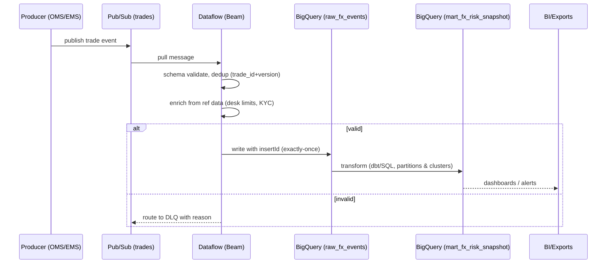

# Tier-1 UK Bank — FX Streaming (GCP) · Sanitized Case Study

[](docs/05-ci-cd.md)
[](docs/)
[](docs/06-license.md)


_A sanitized data-engineering case study demonstrating a real-time FX streaming pipeline on GCP._


---

---

## Docs Index
- [01 – Context](docs/01-context.md)
- [02 – Architecture Overview](docs/02-architecture-overview.md)
- [03 – Sequence (Streaming)](docs/03-sequence-streaming.md)
- [04 – Security Boundary](docs/04-security-boundary.md)
- [05 – CI/CD](docs/05-ci-cd.md)
- [06 – License](docs/06-license.md)


> Note: Sanitized case study from my Cognizant engagement; patterns only—no client code/data.

> **TL;DR**: Real‑time FX event ingestion, validation, enrichment, and analytics on **GCP** using **Pub/Sub → Dataflow (Apache Beam) → BigQuery**, orchestrated by **Composer**, with **VPC‑SC/CMEK** governance. Targets **p95 < 90s** E2E latency at ~**2–2.5M events/day**. This repo shares **patterns only** — no client code or data.

[](#) [](#)

---

## Why this architecture
Risk & compliance require **T+0 visibility** into FX trades. The platform captures trades/quotes, validates & enriches them, and serves curated BigQuery marts and near‑real‑time dashboards with auditable lineage and low ops overhead.

### Key Outcomes
- **Manual interventions ↓ ~95%** via strong DQ + DLQ flows
- **Reporting 2× faster**, intra‑day risk views
- **p95 E2E latency < 90s** at peak **350–500 msg/s**
- **Infra cost ↓ ~35–40%** with BQ partition/cluster + autoscaling

---

## L2 Architecture Overview
```mermaid
flowchart LR
  subgraph Producers
    A[OMS/EMS] -->|Trades| P1[(Pub/Sub: trades)]
    B[Pricing Engine] -->|Quotes| P2[(Pub/Sub: quotes)]
    C[Custodian] -->|Confirms| P3[(Pub/Sub: confirms)]
  end

  subgraph GCP_SecBoundary["GCP Security Boundary (VPC‑SC, CMEK, SA‑IAM)"]
    DF[[Dataflow (Beam)\n• validate+dedup\n• watermarks/late data\n• enrich joins\n• DLQ routing]]
    BQ[(BigQuery\nraw → stage → mart\n(partition+cluster))]
    CMP[Composer (DAGs: replay, compaction, exports, QC)]
    OBS[Cloud Monitoring / Error Reporting\nSLO p95 < 90s]

    P1 --> DF
    P2 --> DF
    P3 --> DF
    DF -->|insertId upserts| BQ
    CMP --> BQ
    DF -->|DLQ| DQ[(DLQ topics)]
    BQ --> OBS
  end

  BQ --> BI[Power BI / Looker\nDashboards & Alerts]
```

---

## Event Life‑cycle (Trades)


---

## Data Model (curated highlights)
- `fx_trade_fact(trade_id PK, version, side, symbol, qty, px, notional_usd, trader, desk, status, event_ts)`
- `fx_limit_breach(desk, symbol, window_notional_usd, limit_usd, breach_flag, breach_ts)`
- `fx_risk_snapshot_1min(ts, desk, symbol, notional_usd, pnl)`

Partition by `trade_date`; cluster by `desk, symbol`. Materialize common aggregates for BI.

---

## SLOs & Observability
- **Delivery success ≥ 99.5%**, **p95 E2E < 90s**, **DLQ rate < 0.5%**
- Cloud Monitoring dashboards on latency, backlog, watermark skew; logs‑based alerts to on‑call.

---

## Author’s responsibilities (what I owned)
- Streaming design on **GCP**; Beam pipelines for **dedup**, **late-data**, **enrichment**, **DLQ**.
- **BigQuery modeling** (raw → stage → mart), partition/cluster strategy, and cost tuning.
- **Security/governance:** **VPC‑SC**, **CMEK**, least‑privilege SA IAM; PII masking UDFs.
- **Ops:** Composer DAGs for replay/compaction/exports; SLOs, alerts, and runbooks.

---

## Repo Map
```
docs/
  01-context.md
  02-architecture-overview.mmd
  03-sequence-streaming.mmd
  04-security-boundary.mmd
  05-data-models.md
  06-slos-observability.md
  07-cost-controls.md
  adr/0001-record-architecture-decisions.md
diagrams/      # export SVG/PNG here if needed
ETHICS.md
SECURITY.md
LICENSE
```

> **Sanitization Note:** Public artifacts are generic; client code/data are intentionally excluded. See `ETHICS.md`.

---

## Reuse this pattern
- Works for **trades, orders, payments, logs, IoT** — any high‑volume event stream with compliance needs.
- Swap **Pub/Sub/Dataflow** with **Kafka/Spark** if required; principles stay the same (contracts, DQ, governance, SLOs).
