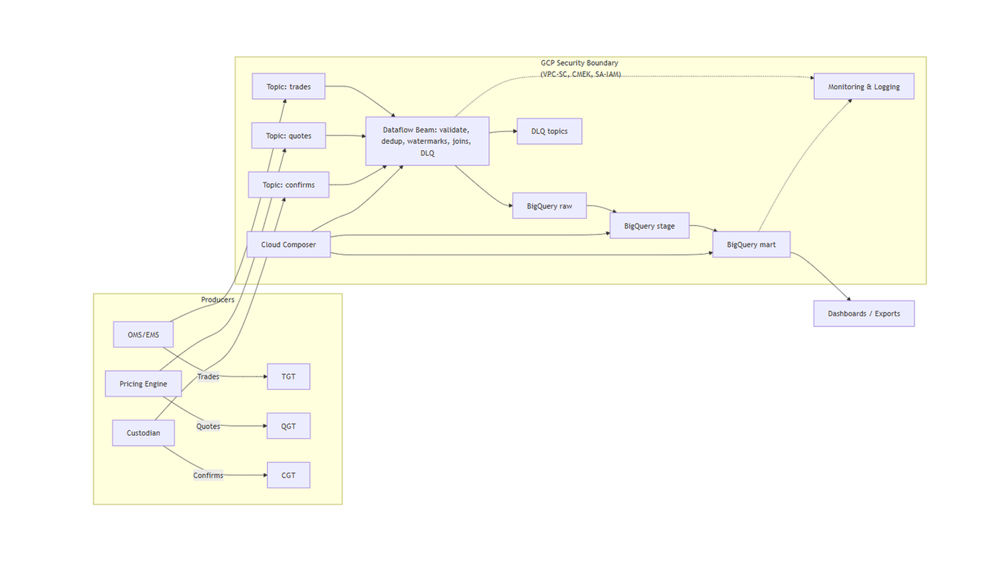
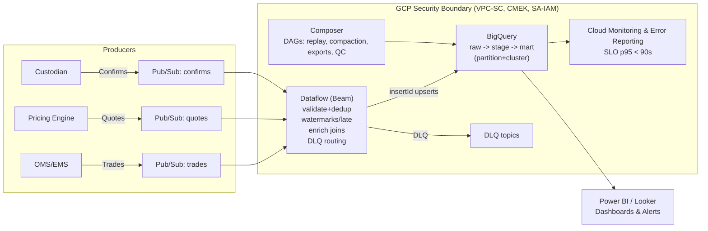
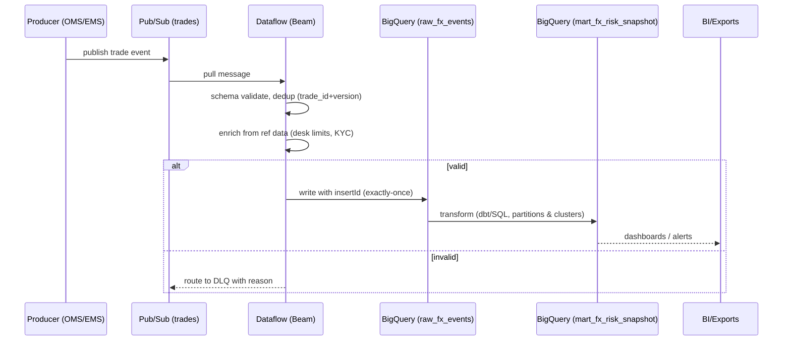

# Tier-1 UK Bank — BARX-style FX Streaming (GCP) · Sanitized Case Study

[](https://github.com/Sahilg135/tier1-uk-bank-fx-streaming-gcp/actions)
[](https://github.com/Sahilg135/tier1-uk-bank-fx-streaming-gcp/releases)
[](./docs/)
[](./LICENSE)

<!-- Ops badges (static, no secrets) -->


_A sanitized data-engineering case study demonstrating a real-time FX streaming pipeline on GCP._

> **What is “BARX-style”?** A reference to a well-known FX trading platform at a Tier-1 UK bank.  
> This repo **simulates** those event-stream patterns (quotes, trades, fills/confirmations).  
> **No client code or data.**

> **Quick Facts**  
> **Use-case:** real-time **BARX-style** FX quotes/trades/confirmations → enrichment → analytics
> **Events:** quotes, trades, fills/confirmations; exactly-once via insertId; late data via watermarks  
> **Stack:** GCP (Pub/Sub → Dataflow/Beam → BigQuery) + Composer; VPC-SC, CMEK  
> **Throughput:** ~6–7 M events/day (~250–400 events/sec); E2E p95 < 90 s  
> **Patterns-only:** no client code/data; fully sanitized
> **Ops:** markdownlint + pre-commit; protected `main`; semver releases  
> **SLOs:** success ≥99.5%, p95 lat <90s, DLQ <0.5%  
> **Cost guardrails:** BQ partition/cluster, Dataflow autoscaling, logs-based budgets


## L2 Architecture – BARX-style Real-Time FX Streaming on GCP
*Illustrates end-to-end ingestion, validation, enrichment, and analytics flow across GCP services (Pub/Sub, Dataflow, BigQuery, Composer).*



## What is FX Streaming?
Real-time ingestion of FX trades/quotes/confirms from OMS/EMS into GCP for validation, enrichment, and analytics with **T+0** visibility (risk, P&L, compliance). This repo is a sanitized docs-only case study; no client code or data.

## Business KPIs
- Trade ingestion success ≥99.5%
- End-to-end p95 latency < 90s (trades → mart)
- DLQ rate < 0.5% per day
- Replay SLA < 30 min for P1 incidents
- Dashboard freshness ≤ 2 min
- Cost per 1M events (target guardrail)
- Data quality failures per 10k events
- Duplicate rate after dedup < 0.1%

## Failure Handling & Replay Flow
1. **Detect**: Cloud Monitoring alert + Error Reporting signature; failed events land in **DLQ**.
2. **Triage**: Classify (schema drift, late/dup, enrichment miss, transient infra).
3. **Fix**: Patch rule/config; ensure idempotency via **`insertId`** semantics.
4. **Replay**: **Composer DAG** drains DLQ → re-enqueue → Dataflow reprocess.
5. **Verify**: QC queries across **raw → stage → mart**; close incident with notes.

## Scaling Strategy (Throughput Guide)
| Peak msg/s | Daily events | Dataflow autoscale (workers) | BigQuery partition/cluster | Notes |
|---:|---:|---:|---|---|
| 100 | 8.6M | 4–8 | `DATE(event_ts)`; cluster `instrument, side` | baseline |
| 300 | 26M | 12–20 | same | watch shuffle; stream insert quotas |
| 500 | 43M | 20–30 | same | consider regionalization; template upgrades |

> See **SLOs & Observability**, **Security Boundary**, and **RUNBOOK** pages for deeper details.


### Operations
- **Runbook:** [RUNBOOK.md](./RUNBOOK.md)  
- **Security:** [SECURITY.md](./SECURITY.md)  
- **Releases:** [Release Notes](https://github.com/Sahilg135/tier1-uk-bank-fx-streaming-gcp/releases)

---

## Docs Index
- [01 – Context](docs/01-context.md)
- [02 – Architecture Overview](docs/02-architecture-overview.md)
- [03 – Sequence (Streaming)](docs/03-sequence-streaming.md)
- [04 – Security Boundary](docs/04-security-boundary.md)
- [05 – Data Models](docs/05-data-models.md)
- [05a – Data Contracts](docs/05a-data-contracts.md)
  – Schemas:
  [trades](contracts/trades.schema.json) ·
  [quotes](contracts/quotes.schema.json) ·
  [confirms](contracts/confirms.schema.json)

- [06 – SLOs & Observability](docs/06-slos-observability.md)
- [07 – Cost Controls](docs/07-cost-controls.md)
- [08 – CI/CD](docs/08-ci-cd.md)
- [09 – License](docs/09-license.md)
- [What is FX Streaming?](#what-is-fx-streaming)
- [Business KPIs](#business-kpis)
- [Failure Handling & Replay Flow](#failure-handling--replay-flow)
- [Scaling Strategy (Throughput Guide)](#scaling-strategy-throughput-guide)
- See also: [RUNBOOK](docs/RUNBOOK.md), [SECURITY](./SECURITY.md)
- [Release Notes](https://github.com/Sahilg135/tier1-uk-bank-fx-streaming-gcp/releases)

> Note: Sanitized case study from my Cognizant engagement; patterns only—no client code/data.

**TL;DR.** Real-time FX event ingestion, validation, enrichment, and analytics on **GCP** using **Pub/Sub → Dataflow (Apache Beam) → BigQuery**, orchestrated by **Composer**, with **VPC-SC/CMEK** governance. Targets **p95 < 90s** E2E latency at ~**2–2.5M events/day**.  
Security model: see [SECURITY.md](./SECURITY.md).

---

## 📁 Repository Overview
- Real-time ingestion (**Pub/Sub → Dataflow → BigQuery**)
- Orchestration with **Cloud Composer**
- Governance via **VPC-SC & CMEK**
- Observability & **cost-control** docs
### SLO & Cost Summary

| Metric | Target | Monitoring / Notes |
|---------|---------|--------------------|
| **E2E latency (p95)** | `< 90s` | Dataflow metrics (latency, watermark skew) |
| **Delivery success** | `≥ 99.5%` | Pub/Sub delivery metrics |
| **DLQ rate** | `< 0.5% of daily volume` | Dataflow error-handling counters |
| **Daily cost (est.)** | `~$8–12/day` | BigQuery slot + Dataflow job cost (GCP free-tier optimized) |
| **Storage footprint** | `~3–5 GB/day` | GCS, lifecycle policies applied |


## Why this architecture
Risk & compliance require **T+0 visibility** into FX trades. The platform captures trades/quotes, validates & enriches them, and serves curated BigQuery marts and near-real-time dashboards with auditable lineage and low ops overhead.

### Key Outcomes
- **Manual interventions ↓ ~95%** via strong DQ + DLQ flows  
- **Reporting 2× faster**, intra-day risk views  
- **p95 E2E latency < 90s** at peak **350–500 msg/s**  
- **Infra cost ↓ ~35–40%** using BQ partition/cluster + autoscaling

---
## L2 Architecture Overview



---

## Event Life-cycle (Trades)


---


## Data Model (curated highlights)
- `fx_trade_fact(trade_id PK, version, side, symbol, qty, px, notional_usd, trader, desk, status, event_ts)`
- `fx_limit_breach(desk, symbol, window_notional_usd, limit_usd, breach_flag, breach_ts)`
- `fx_risk_snapshot_1min(ts, desk, symbol, notional_usd, pnl)`

Partition by `trade_date`; cluster by `desk, symbol`. Materialize common aggregates for BI.

---

## SLOs & Observability
- **Delivery success ≥ 99.5%**, **p95 E2E < 90s**, **DLQ rate < 0.5%**
- Cloud Monitoring dashboards on latency, backlog, watermark skew; logs‑based alerts to on‑call.

---

## Author’s responsibilities (what I owned)
- Streaming design on **GCP**; Beam pipelines for **dedup**, **late-data**, **enrichment**, **DLQ**.
- **BigQuery modeling** (raw → stage → mart), partition/cluster strategy, and cost tuning.
- **Security/governance:** **VPC‑SC**, **CMEK**, least‑privilege SA IAM; PII masking UDFs.
- **Ops:** Composer DAGs for replay/compaction/exports; SLOs, alerts, and runbooks.

---

## Repo Map
```
tier1-uk-bank-fx-streaming-gcp/
├─ README.md
├─ RUNBOOK.md
├─ SECURITY.md
├─ ETHICS.md
├─ LICENSE
├─ CODEOWNERS
├─ CODE_OF_CONDUCT.md
├─ CONTRIBUTING.md
├─ .pre-commit-config.yaml
├─ .markdownlint.jsonc
├─ .markdownlint-cli2.jsonc
├─ docs/
│  ├─ 01-context.md
│  ├─ 02-architecture-overview.md
│  ├─ 03-sequence-streaming.md
│  ├─ 04-security-boundary.md
│  ├─ 05-data-models.md
│  ├─ 06-slos-observability.md
│  └─ 07-cost-controls.md
├─ contracts/
│  ├─ trades.schema.json
│  ├─ quotes.schema.json
│  └─ confirms.schema.json
├─ qc_examples.sql        # row-count reconciliation example
├─ adr/
│  └─ 0001-record-architecture-decisions.md
└─ 0001-use-pubsub-dataflow-bq.md
```

> **Sanitization Note:** Public artifacts are generic; client code/data are intentionally excluded. See `ETHICS.md`.

---

## Reuse this pattern

---

### Minimal commit plan (copy the messages)

1. `docs(readme): add quick-facts, real CI+Release badges; link SECURITY; remove duplicate hr`  
2. `docs(readme): fix Repo Map to .md for diagrams; add ADR + Release notes link`  
3. If any of 05–09 pages don’t exist, either **create stubs** or remove links:  
   - `docs: add stubs for data models, slos/observability, cost controls, ci/cd, license`

**If you prefer Option A (rename files):**  
Rename any `docs/*.mmd` → `*.md` and keep the Mermaid code blocks unchanged.

That’s it. Publish `v0.1.1` after these edits and pin the release in LinkedIn Featured.
::contentReference[oaicite:0]{index=0}
